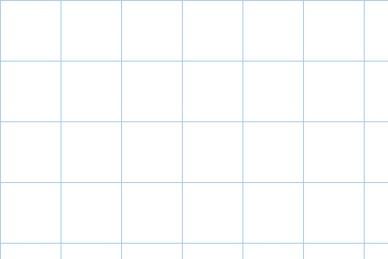
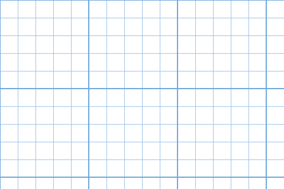
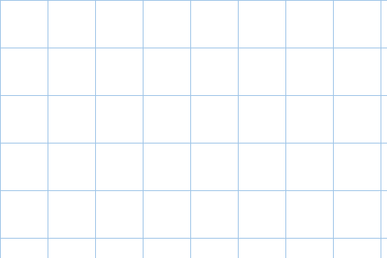

# Grid Paper Layer — Krita plugin

Adds a **Tools → Scripts → Add Graph Paper Grid Layer...** action that renders a
graph-paper grid onto a new paint layer, using the standard printable graph
paper sizes (as on dadsworksheets.com "Plain Graph Paper"):

| Standard (imperial) | Metric |
| --- | --- |
| 1/4 inch (4 squares per inch) | 1 cm (10 mm) |
| 1/5 inch (5 squares per inch) | 5 mm |
| 1/8 inch (8 squares per inch) | 4 mm |
| 1/10 inch (10 squares per inch) | 2 mm |

The pixel spacing is computed from the **document's DPI** (`Image →
Properties → Resolution`), so squares are true physical size when printed at
100%. Example: a 1/4" grid on a 300 DPI document = 75 px squares.

| 1/4 inch | 1/10 inch, bold every 5 | 5 mm |
| --- | --- | --- |
|  |  |  |

*Sample output at 300 DPI: plain 1/4" graph paper, engineering-style 1/10"
with a bold line every 5 squares, and metric 5 mm.*

## Options

- **Grid size** — the eight standard sizes above; the dialog shows the
  resulting square size in pixels for the current document.
- **Line width / color** — defaults to 1 px classic graph-paper blue.
  Colors support alpha for fainter grids.
- **Bold line every N squares** (off by default) — engineering-paper style
  heavier accent line, with its own width and color.

Settings are remembered between uses. The grid is added as a normal paint
layer at the top of the stack — lower its opacity, move it, or set it as a
guide however you like.

## Install

Copy `kritapykrita_gridpaper.desktop` and the `gridpaper/` folder into Krita's
`pykrita` resource folder:

- Windows (installer/portable): `%APPDATA%\krita\pykrita\`
- Windows (Microsoft Store build): `%LOCALAPPDATA%\Packages\49800KritaProject.Krita_n3kgb906j1zjg\LocalCache\Roaming\krita\pykrita\`
  (the Store build virtualizes its AppData — it does not read `%APPDATA%\krita`)
- Linux: `~/.local/share/krita/pykrita/`
- macOS: `~/Library/Application Support/krita/pykrita/`

Then in Krita: **Settings → Configure Krita → Python Plugin Manager**, enable
**Grid Paper Layer**, and restart Krita.

## Notes

- Works on any document color model — the grid layer converts itself to
  RGBA 8-bit if needed and Krita composites it into the document.
- If the chosen grid is finer than the line width at the document's DPI
  (e.g. 2 mm at very low DPI), the plugin warns instead of producing a solid
  fill.
